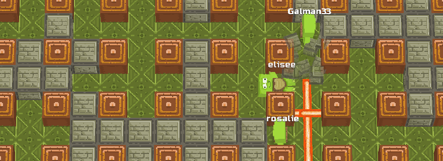
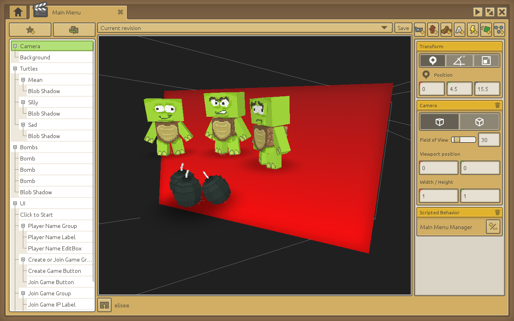
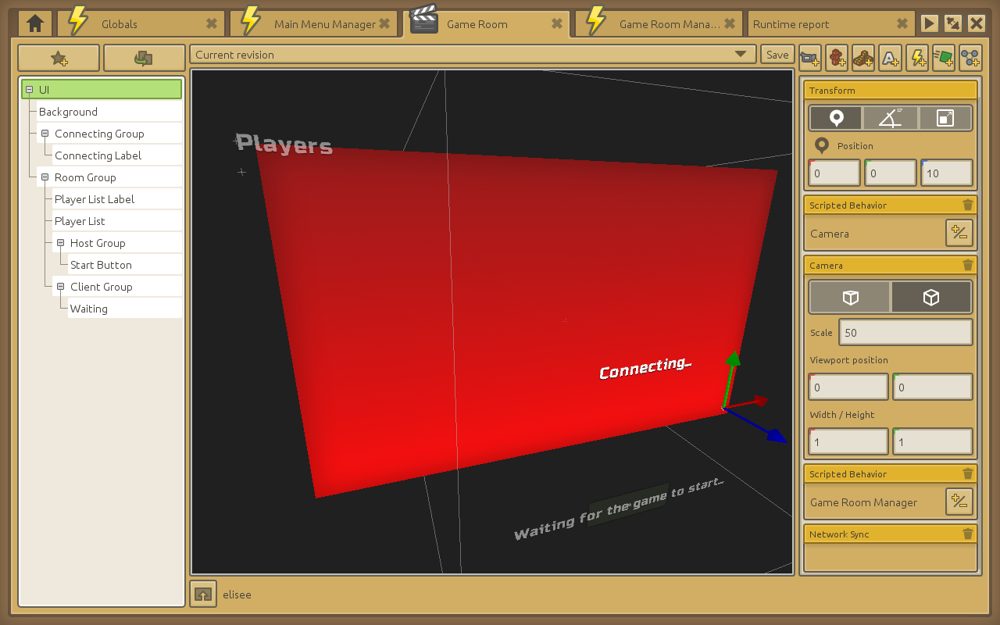
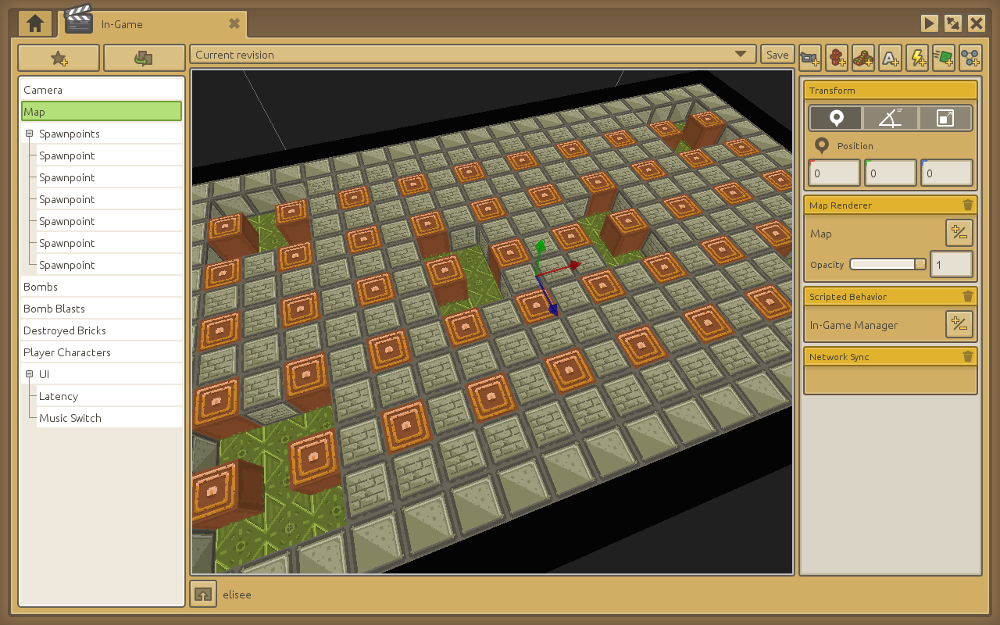
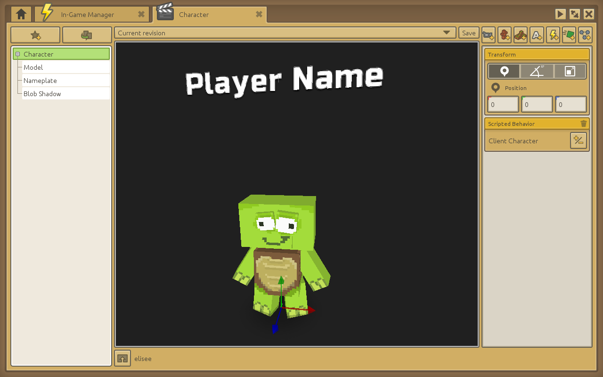

# Building a multiplayer Bomberman-like

----

## What's in this tutorial

This tutorial assumes you already are fairly proficient with CraftStudio. If this is your first game, consider [checking out the introduction](Introduction) and [starting with a more beginner-oriented tutorial](Space_shooter).

We'll focus mostly on the networking aspects of building an online multiplayer game, keeping the game mechanics fairly simple while still making something fun to play!



Our game, which we shall call **Blast Turtles**, will be a Bomberman-like. [Bomberman](http://en.wikipedia.org/wiki/Bomberman) is a top-down strategic real-time versus game in which you control a character that can place bombs to destroy bricks and annihilate their opponents in order to be the last one standing.

<iframe width="880" height="495" src="//www.youtube.com/embed/c-Kz7AWGZf8" frameborder="0" allowfullscreen></iframe>

----

## Follow along!

Before starting, I recommend you [join the CraftStudio project](http://open.craftstud.io/craftstud.io/62dcb6be-3260-4b23-91e4-16f7fa7cd82b) so that you can follow along by looking at the project.

----

## Turtles & map

Players will be controlling a cartoon turtle like this one:


<!-- <iframe src="http://store.craftstud.io/viewer?"></iframe> -->

The turtles will be moving around from tile to tile in a full-screen map. The map (which is pretty typical for this type of games) has a grass floor bordered by rock blocks and features unbreakable wooden columns surrounded by bomb-breakable brick blocks. Here's the 32x32x32 tile set I built:


The playable area is 19 tiles long and 11 tiles tall. Here's an overview of the map itself:


I carved out 6 spots so that up to 6 players can spawn and play together.

----

## Main Menu

The game starts up on the main menu scene, waiting for the player to click.



The main menu is driven by a script named ```Main Menu Manager```. Once the player clicks, a timer is started to make the bombs fly out of the screen (see the ```Main Menu Manager```'s ```Behavior:Update``` function).

### Asking the player for their name

In order to let the player input their name and click buttons, the game uses a few user interface scripts I put together (they can be found in the ```Menu/UI``` folder of the project).


The Player Name prompt is created by having a game object named ```Player Name EditBox``` with a scripted behavior component set up like so:


Text is displayed using a ```TextRenderer``` component on a child game object, and the cursor is drawn by another child game object with a model renderer.

Once the bombs animation is over, the EditBox is given the focus &mdash;by calling ```editBoxGameObject:SetState( "Focused" )```&mdash; which sets up the ```CS.Input.OnTextEntered``` event handler like so:

```lua
-- (extract from the Menu/UI/EditBox script)

-- This function, passed as a parameter to CS.Input.OnTextEntered below,
-- will be called whenever the player types something.
self.onTextEntered = function( char )
    -- The typed character is converted into its numerical ASCII index
    local charNumber = string.byte(char)
    
    -- 8 stands for Backspace
    if charNumber == 8 then
        -- Erase the last character from the EditBox's text
        self.gameObject.text = self.gameObject.text:sub( 1, #self.gameObject.text - 1 )
    -- 13 is Return
    elseif charNumber == 13 then
        -- If a "validation" callback function has been set, call it
        if self.onValidateCallback ~= nil then
            self.onValidateCallback( self.gameObject )
        end
    -- Any character between 32 and 127 is regular printable ASCII
    elseif charNumber >= 32 and charNumber <= 127 then
        -- As long as we haven't exceeded the max field length, append it
        if #self.gameObject.text < self.MaxLength or self.MaxLength == 0 then
            self.gameObject.text = self.gameObject.text .. char
        end
    end
    
    -- Update the text displayed by the text renderer and the cursor's position
    self.textGO.textRenderer:SetText( self.gameObject.text )
    self:UpdateCursor()
end

-- (...)

CS.Input.OnTextEntered( self.onTextEntered )
```

In the ```Main Menu Manager``` script, a validation callback function is set up for when the player presses Return.

```lua
-- (extract from Menu/Main Menu/Main Menu Manager)

function Behavior:Start()
    -- (...)
  
    HideSetupPlayerName = function()
        -- Switch the EditBox to Unfocused state
        -- so that it clears the OnTextEntered callback
        self.playerNameEditBox:SetState( "Unfocused" )
        
        -- Scale the whole group to 0 to make it disappear
        self.playerNameGroup.transform:SetLocalScale( Vector3:New(0) )
    end
    
    -- (...)
    
    -- Player Name
    self.playerNameEditBox:OnValidate( function()
        -- Ensure the player name is at least 3 characters long
        if #self.playerNameEditBox.text < 3 then return end
        
        PlayerName = self.playerNameEditBox.text
        
        HideSetupPlayerName()
        ShowCreateOrJoinGame()
    end )
    
    -- (...)
end
```

The player's name is stored in a global variable named ```PlayerName``` (see ```Globals``` script) which will be accessible from other scenes.

Feel free to check out the various menu scripts in the project itself to learn more about how it's all articulated. This tutorial's focus is on networking so we won't be covering every detail of the menu's inner workings.

### Creating or joining a game

After inputting their name, the player is then offered the choice between hosting their own game or joining an existing game (by typing in the host computer's IP address).

The global variables ``IsHost`` and ``IpToConnect`` are initialized accordingly before switching to the game room:

```lua
-- Callback function for when the "Create Game" button is clicked
self.createGameButton:OnClick( function()
    IsHost = true
    IpToConnectTo = "127.0.0.1"

    CS.LoadScene( CS.FindAsset( "Game Room", "Scene" ) )
end )

-- (...)

-- Joining a game
-- Callback function for when the IP to join EditBox is validated with the Return key
self.joinGameIPEditBox:OnValidate( function()
    IsHost = false
    IpToConnectTo = self.joinGameIPEditBox.text
    
    HideJoinGame()
    CS.LoadScene( CS.FindAsset( "Game Room", "Scene" ) )
end )

```


----
## Game Room

The ``Game Room`` scene takes care of connecting players together and allows the host to launch the game.



The ``Menu/Game Room/Game Room Manager`` script shows and hides the proper user interface parts depending on the ``IsHost`` global variable so that the host sees the "Start Game" button while the client players see a waiting message instead.

```lua
function Behavior:Awake()
    -- (...)

    if IsHost then
        self:SetupHost()
        self.clientGroup.transform:SetLocalScale( Vector3:New(0) )
    else
        self.hostGroup.transform:SetLocalScale( Vector3:New(0) )
    end
    
    self:SetupClient()
end
```

### Server (aka. Host) setup

The ```Behavior:SetupHost``` function is where we finally start touching actually networking stuff.

First off, we initialize the global variable ```ServerGameData``` which will track player and game state, then we actually start listening for incoming connections with ```CS.Network.Server.Start```.

```lua
-- (extract from Menu/Game Room/Game Room Manager)

function Behavior:SetupHost()
    ServerGameData = {
        public = {
            playersById = {},
            playersCount = 0
        },
        
        hasGameStarted = false,
        connectedClientsCount = 0,
        
        inactivePlayersById = {},
        activePlayerIds = {}
    }
    
    CS.Network.Server.Start()
    CS.Network.Server.OnPlayerJoined( OnPlayerJoined )
    CS.Network.Server.OnPlayerLeft( OnPlayerLeft )
end
```

```ServerGameData.public``` contains data that we'll send to each player as they connect: the full list of active players and the player count.

When a client connects, they are first added to the ```ServerGameData.inactivePlayersById``` table until they send their player name:

```lua
local OnPlayerJoined = function( player )
    if not ServerGameData.hasGameStarted and ServerGameData.connectedClientsCount < MaxPlayersCount then
        -- Add new player to inactive player list until we get their setup info
        ServerGameData.inactivePlayersById[ player.id ] = player
        
        ServerGameData.connectedClientsCount = ServerGameData.connectedClientsCount + 1
    else
        -- Prevent any new players from joining once the game has started
        -- or the max player count has been reached
        CS.Network.Server.DisconnectPlayer( player.id )
    end
end
```

As you can see, before adding the player, the ```OnPlayerJoined``` callback checks that the game hasn't been started already and that the ```MaxPlayersCount``` hasn't been reached either. Otherwise, the newly connected player is disconnected right away.

The ```OnPlayerLeft``` callback takes care of responding to player disconnection:

```lua
local OnPlayerLeft = function( playerId )
    ServerGameData.connectedClientsCount = ServerGameData.connectedClientsCount - 1
    
    -- Check if the player had already sent its player name
    local wasActivePlayer = false
    
    for i, activePlayerId in ipairs(ServerGameData.activePlayerIds) do
        if playerId == activePlayerId then
            table.remove( ServerGameData.activePlayerIds, i )
            wasActivePlayer = true
            break
        end
    end
    
    if wasActivePlayer then
        if ServerGameData.hasGameStarted then
            -- Ignore dropped out players after the game has started
            return
        end
        
        -- If the game hasn't started, remove the player from the table
        ServerGameData.public.playersById[ playerId ] = nil
        ServerGameData.public.playersCount = ServerGameData.public.playersCount - 1
        
        -- Let all active players know about the disconnected player
        self.gameObject.networkSync:SendMessageToPlayers( "PlayerRemoved", { playerId=playerId }, ServerGameData.activePlayerIds )
    else
        -- A player who hadn't sent their name yet has disconnected
        -- Just clear them from the inactive player table
        ServerGameData.inactivePlayersById[ playerId ] = nil
    end
end
```

### Client (aka. Player) setup

On the client-side, as soon as the game room is entered, ```Behavior:SetupClient``` is called. Its role is to initiate connection to the server and set up callbacks to react to a successful or failed connection.

```lua
function Behavior:SetupClient()
    ClientGameData = {}
    
    CS.Network.Connect( IpToConnectTo, CS.Network.DefaultPort, function()
        self.connectingGroup.transform:SetLocalScale( Vector3:New(0) )
        self.roomGroup.transform:SetLocalScale( Vector3:New(1) )
        
        self.gameObject.networkSync:SendMessageToServer( "SetPlayerInfo", { name=PlayerName } )
    end )
    
    -- Handle disconnection / inability to connect
    CS.Network.OnDisconnected( function()
        self:GoBackToMainMenu()
    end )
end
```

```CS.Network.Connect``` takes up to 3 arguments (although only the first is required):

  1. the IP or hostname to connect to ;
  2. which port to use (we use the default one, which happens to be port 4233) ;
  3. Connecting to a remote server takes a bit of time and might fail, so we can't just call ```CS.Network.Connect``` and then start sending messages right away. The 3rd argument lets us specify a function to call once the connection has been properly established.

The callback function specified in our case simply hides the "Connecting..." message (contained in the Connecting Group game object) by scaling it down to 0, makes "Waiting for the game to start..." appear instead and send our player name to the server.

At the end of ```Behavior:SetupClient```, a ```CS.Network.OnDisconnected``` callback is set up in case we face a disconnection. You can see it will call ```Behavior:GoBackToMainMenu``` which is a clean-up function that will ensure everything has been stopped / reset before loading the ```Main Menu``` scene again.

### Launching the game!

When the player who hosts the game clicks the "Start" button, ```Behavior:LaunchGame``` is called. It marks the game as started on the server-side, disconnects all players that haven't sent their name yet, sends a message to every client so that they know the game has started and finally, loads up the in-game scene.

```lua
function Behavior:LaunchGame()
    ServerGameData.hasGameStarted = true
    
    -- Disconnect all inactive players
    for inactivePlayerId, inactivePlayer in pairs(ServerGameData.inactivePlayersById) do
        CS.Network.Server.DisconnectPlayer( inactivePlayerId )
        ServerGameData.connectedClientsCount = ServerGameData.connectedClientsCount - 1
    end
    
    ServerGameData.inactivePlayersById = {}
    
    -- Let people know the game started and move to the In-Game scene
    self.gameObject.networkSync:SendMessageToPlayers( "StartGame", nil, ServerGameData.activePlayerIds )
    CS.LoadScene( CS.FindAsset( "In-Game", "Scene" ) )
end
```

On the client-side, receiving the StartGame message simply loads up the in-game scene:

```lua
function Behavior:StartGame()
    if not IsHost then
        CS.LoadScene( CS.FindAsset( "In-Game", "Scene" ) )
    end
end
CS.Network.RegisterMessageHandler( Behavior.StartGame, CS.Network.MessageSide.Players )
```

----
## Getting ready for action

The ```In-Game``` scene is where all the fun happens! All players are now connected to the server and we're about to start actual gameplay.



The ```Map``` game object holds a map renderer for displaying the map, an ```In-Game Manager``` scripted behavior for handling all the game logic and a network sync component for passing around messages between the players and the server.

The ```Behavior:Awake``` function from the ```In-Game Manager``` script puts things in motion:

```lua
function Behavior:Awake()
    -- Setup the network sync ID so that we can send & receive messages
    self.gameObject.networkSync:Setup( NetworkSyncIds.inGame )
    
    -- Swap displayed map with a copy to avoid modifying the original asset
    local mapRenderer = CS.FindGameObject( "Map" ).mapRenderer
    self.originalMapAsset = mapRenderer:GetMap()
    self.clientMapAsset = Map.LoadFromPackage( self.originalMapAsset:GetPathInPackage() )
    mapRenderer:SetMap( self.clientMapAsset )
    
    if IsHost then
        self.isServerGameInitialized = false
        self.readyPlayers = {}
        self.readyPlayersCount = 0
    end
    
    self.isClientGameInitialized = false
    self.gameObject.networkSync:SendMessageToServer( "MarkPlayerReady" )
end
```

We're not using the Game Room network sync anymore so we need to set up the new one with its ID (```NetworkSyncIds.inGame``` is defined in the ```Globals``` script if you want to find it, it has a value of 1).

We need to swap the displayed map with a copy so that, even after blocks are destroyed during game-play, we can still get the original map back when a new round starts. This is done by:

 * Getting the map asset displayed by the map renderer
 * Getting its path in the game data package with ```Map:GetPathInPackage```
 * Loading a new copy with ```Map.LoadFromPackage```
 * Updating the map renderer to display the newly created copy of the map asset
 
We'll be keeping a reference to our copied map in ```self.clientMapAsset``` so that we can update it when blocks are destroyed by bombs.

Finally, we send a "MarkPlayerReady" message to the server to let it know that we're ready for the round to start.

### Starting a new round

On the server-side, we'll be waiting for "MarkPlayerReady" messages from all players before starting the round.

This is done so that each player's computer has the time load up the new scene and set up its network sync component before the server starts spouting tons of gameplay messages at them. Otherwise, some players might take longer to receive the "StartGame" message from the Game Room scene and end up missing the first few gameplay messages.

```lua
function Behavior:MarkPlayerReady( data, playerId )
    if not self.readyPlayers[playerId] then
        self.readyPlayers[playerId] = true
        self.readyPlayersCount = self.readyPlayersCount + 1
        
        if self.readyPlayersCount == ServerGameData.public.playersCount then
            -- All players are now ready, start the round!
            self:InitServerGame()
        end
    end
end
CS.Network.RegisterMessageHandler( Behavior.MarkPlayerReady, CS.Network.MessageSide.Server )
```

Once the ready players count has reached the total number of players in the game, ```Behavior:InitServerGame``` gets called.

```lua
function Behavior:InitServerGame()
    -- Just like on the client, let's make a copy of the map asset for the server
    self.serverMapAsset = Map.LoadFromPackage( self.mapAsset:GetPathInPackage() )
    
    -- Create characters
    ServerGameData.charactersByPlayerId = {}
    
    -- (We'll be picking a random spawn point for each player)
    local spawnPoints = CS.FindGameObject( "Spawnpoints" ):GetChildren()
    local spawnPointIndicesByPlayerId = {}
    local usedSpawnPointIndices = {}
    
    -- For each player...
    for playerId, player in pairs(ServerGameData.public.playersById) do
        -- Try and find an unused spawn point for this player's character
        local spawnPointIndex
        repeat
            spawnPointIndex = math.random( 1, #spawnPoints )
        until not usedSpawnPointIndices[ spawnPointIndex ]
        
        usedSpawnPointIndices[ spawnPointIndex ] = true
        spawnPointIndicesByPlayerId[ playerId ] = spawnPointIndex
        
        local spawnPointPos = spawnPoints[ spawnPointIndex ].transform:GetPosition()
        
        -- Add this player's initial character data to the characters table
        ServerGameData.charactersByPlayerId[ playerId ] = {
            playerId = playerId,
            isAlive = true,
            
            x = spawnPointPos.x / MapTileSize * SizeMultiplier,
            z = spawnPointPos.z / MapTileSize * SizeMultiplier,
            
            targetX = spawnPointPos.x / MapTileSize * SizeMultiplier,
            targetZ = spawnPointPos.z / MapTileSize * SizeMultiplier,
            
            activeBombsCount = 0,
            maxBombsAtOnce = 5,
            
            input = { moveDirection=MoveDirections.None, placeBomb=false },
        }
    end
    
    -- Tell all players the round is starting, providing them with the spawn point used by each character
    self.gameObject.networkSync:SendMessageToPlayers( "InitClientGame", { spawnPointIndicesByPlayerId=spawnPointIndicesByPlayerId } )
    
    -- Setup bombs table
    ServerGameData.bombsById = {}
    ServerGameData.nextBombId = 0
   
    -- The server-side game is now initialized!
    self.isServerGameInitialized = true
end
```

Setting ```self.isServerGameInitialized``` will let the game logic defined in ```Behavior:DoServerTick``` (called 60 times a second from ```Behavior:Update``` actually run.

### Creating the characters on the client

On the server, each character is just a table containing states like position, target and bombs count.

But on the client, we need to create actual game objects to display and animate our characters.

For each character, we'll instantiate the ```Prefabs/Character``` scene which contains game objects for displaying the turtle, a blob shadow and a nameplate:



This is all done in the ```Behavior:InitClientGame``` message handler:

```lua
function Behavior:InitClientGame( data )
    self.uiGO = CS.FindGameObject( "UI" )
    
    -- Create characters
    ClientGameData.characterGOsByPlayerId = {}
    
    local spawnPoints = CS.FindGameObject( "Spawnpoints" ):GetChildren()
    local index = 1
    
    local playerCharactersGO = CS.FindGameObject( "Player Characters" )
    
    for playerId, player in pairs(ClientGameData.public.playersById) do
        -- Create the character's game object on the map
        local spawnPointPos = spawnPoints[ data.spawnPointIndicesByPlayerId[ playerId ] ].transform:GetPosition()
        
        local characterGO = CS.AppendScene( CharacterPrefab, playerCharactersGO )
        ClientGameData.characterGOsByPlayerId[ playerId ] = characterGO
        
        characterGO:SetName( "Player Character " .. playerId )
        characterGO:FindChild( "Nameplate" ).textRenderer:SetText( player.name )
        characterGO.transform:SetPosition( spawnPointPos )
        
        -- Create the character cartridge (for displaying scores)
        local playerCartridgeGO = CS.AppendScene( PlayerCartridgePrefab, self.uiGO )
        playerCartridgeGO:SetName( "Player Cartridge " .. playerId )
        playerCartridgeGO.transform:SetLocalPosition( Vector3:New( -39.5 + (index-1)%4 * 18, 24 - math.floor((index-1)/4) * 1.5, -1 ) )
        
        playerCartridgeGO:FindChild( "Player Name" ).textRenderer:SetText( player.name )
        playerCartridgeGO:FindChild( "Player Score" ).textRenderer:SetText( tostring(player.score) )
        
        index = index + 1
    end
    
    -- Setup bombs table
    ClientGameData.bombsById = {}
    
    -- Setup game object references
    ClientGameData.mainCameraGO = CS.FindGameObject( "Camera" )
    self.bombsGO = CS.FindGameObject( "Bombs" )
    self.destroyedBricksGO = CS.FindGameObject( "Destroyed Bricks" )
    self.bombBlastsGO = CS.FindGameObject( "Bomb Blasts" )

    
    -- Screen shake (for when bombs explode)
    self.screenShake = 0
    self.initialCameraPosition = ClientGameData.mainCameraGO.transform:GetLocalPosition()
    
    -- Setup initial input data (not moving, not placing bombs)
    self.input = {
        moveDirection = MoveDirections.None,
        placeBomb = false
    }
    
    -- This table keeps track of locally-predicted moves so that we don't
    -- play them again when the server confirms them
    self.predictedMoves = {}
    
    -- Latency reporting
    -- (shows the time a network packet takes to go from the client to the server and back)
    local latencyGO = self.uiGO:FindChild( "Latency" )
    
    CS.Network.OnLatencyUpdated( function( latency )
        latencyGO.textRenderer:SetText( tostring(math.round(latency * 1000)) .. "ms" )
    end )
    
    self.isClientGameInitialized = true
end
CS.Network.RegisterMessageHandler( Behavior.InitClientGame, CS.Network.MessageSide.Players )
```

----
## Gameplay loop

Characters have been created and everything is setup. What happens now? The ```In-Game Manager```'s ```Behavior:Update``` function is called 60 times a second and takes care of advancing the game:

```lua
function Behavior:Update()
    -- Do server stuff if we're the server and the game started
    if IsHost and self.isServerGameInitialized then
        self:DoServerTick()
    end
    
    -- Do client stuff if the game started
    if self.isClientGameInitialized then
        self:DoInput()
        self:DoClientSidePrediction()
        self:DoScreenShake()
    end
end
```

Pretty self-explanatory, right? Let's dig in.

### Player input

If we were to let players command their character on the server directly, cheaters could hack the game to teleport, move very fast or place tons of bombs.

Rather than letting players do that, the server will simply collect input from each player and will then decide what to do with it.

Let's start by looking at ```Behavior:DoInput```, the client-side function that takes care of reading keyboard input and sending it to the server:

```lua
function Behavior:DoInput()
    local moveDirection = MoveDirections.None

    if CS.Input.IsButtonDown( "Up" ) then
        moveDirection = MoveDirections.Up
    elseif CS.Input.IsButtonDown( "Right" ) then
        moveDirection = MoveDirections.Right
    elseif CS.Input.IsButtonDown( "Down" ) then
        moveDirection = MoveDirections.Down
    elseif CS.Input.IsButtonDown( "Left" ) then
        moveDirection = MoveDirections.Left
    end
    
    local placeBomb = CS.Input.IsButtonDown( "Space" )
    
    -- Only send an input update to the server if something actually changed
    if moveDirection ~= self.input.moveDirection or placeBomb ~= self.input.placeBomb then
        self.input.moveDirection = moveDirection
        self.input.placeBomb = placeBomb
        self.gameObject.networkSync:SendMessageToServer( "SetInput", self.input )
    end
end
```

Since ```Behavior:DoInput``` will be called a lot (60 times a second), we make sure it's only sending messages to the server when the player actually changed what they are doing, otherwise we'll be flooding the network with unnecessary messages. We do that by comparing inputs from the current tick with input from last tick.

On the server-side of things, the ```Behavior:SetInput``` message handler simply updates the character's input table:

```lua
function Behavior:SetInput( input, playerId )
    ServerGameData.charactersByPlayerId[ playerId ].input = input
end
CS.Network.RegisterMessageHandler( Behavior.SetInput, CS.Network.MessageSide.Server )
```

### Server tick

The server's update takes care of the following duties:

  * If the game is over, wait a bit until it's time to start a new round
  * Otherwise, loop over characters and 
    * apply players input, updating each character's target coordinates and interpolate between their current position and their target position
    * If ```character.input.placeBomb``` is true (meaning the player is holding Space down) and the character is at the center of a tile, call ```Behavior:PlaceServerBomb``` on the character
  * Then loop over bombs, making their timers tick and explode those whose timers have reached zero

```lua
function Behavior:DoServerTick()
    -- Handle game over
    if ServerGameData.gameOver ~= nil then
        self:HandleServerGameOver()
        return
    end
    
    -- Tick characters
    local aliveCharacters = {}
    
    for playerId, character in pairs(ServerGameData.charactersByPlayerId) do
        if character.isAlive then
            table.insert( aliveCharacters, character )
            
            if character.targetX == character.x and character.targetZ == character.z then
                -- Character has reached its target position / is at rest
                
                if character.input.placeBomb then
                    -- Character wants to place a bomb
                    self:PlaceServerBomb( character )
                end
                
                if character.input.moveDirection ~= MoveDirections.None then
                    -- Character wants to move in a direction
                    self:MoveServerCharacter( character )
                end
            end
            
            if character.targetX ~= character.x or character.targetZ ~= character.z then
                -- Move towards target position
                if character.targetX < character.x then
                    character.x = math.max( character.targetX, character.x - CharacterMoveSpeed )
                elseif character.targetX > character.x then
                    character.x = math.min( character.targetX, character.x + CharacterMoveSpeed )
                elseif character.targetZ < character.z then
                    character.z = math.max( character.targetZ, character.z - CharacterMoveSpeed )
                elseif character.targetZ > character.z then
                    character.z = math.min( character.targetZ, character.z + CharacterMoveSpeed )
                end
            end
        end
    end
    
    -- Detect game over
    if #aliveCharacters <= 1 and ( ServerGameData.public.playersCount > 1 or #aliveCharacters == 0 ) then
        -- Start game restart timer
        ServerGameData.gameOver = 0
        
        -- Increase winner player's score
        local winnerPlayer = nil
        if ServerGameData.public.playersCount > 1 then
            -- FIXME: Handle the case were all players died at the same time
            winnerPlayer = ServerGameData.public.playersById[ aliveCharacters[1].playerId ]
        else
            winnerPlayer = ServerGameData.public.playersById[ ServerGameData.activePlayerIds[1] ]
        end
        
        winnerPlayer.score = winnerPlayer.score + 1
        self.gameObject.networkSync:SendMessageToPlayers( "SetClientPlayerScore", { playerId=winnerPlayer.id, score=winnerPlayer.score } )
        
        return
    end
    
    -- Tick bombs
    local bombsAboutToExplode = {}
    
    for bombId, bomb in pairs(ServerGameData.bombsById) do
        bomb.public.timer = bomb.public.timer - 1
        if bomb.public.timer == 0 then
            -- The bomb explodes!
            bomb.aboutToExplode = true
            table.insert( bombsAboutToExplode, bomb )
        end
    end
    
    -- Handle bomb explosions
    for bombIndex, bomb in ipairs(bombsAboutToExplode) do
        -- Decrease the character's active bombs count
        local character = ServerGameData.charactersByPlayerId[ bomb.public.playerId ]
        character.activeBombsCount = character.activeBombsCount - 1
        
        ServerGameData.bombsById[ bomb.public.id ] = nil
        
        self.gameObject.networkSync:SendMessageToPlayers( "ExplodeBomb", { bombId=bomb.public.id } )
        
        -- Dig holes into the map
        -- TODO: customize bomb range based on character stats
        local blastLengthByDirection = self:ExplodeBlocks( self.serverMapAsset, bomb.public.x / SizeMultiplier, bomb.public.z / SizeMultiplier, bomb.public.range )
        
        for blastedBombId, blastedBomb in pairs(ServerGameData.bombsById) do
            if not blastedBomb.aboutToExplode and self:IsInBombBlast( bomb, blastLengthByDirection, blastedBomb.public.x, blastedBomb.public.z ) then
                -- Another bomb was hit by this bomb's blast
                -- Mark it as about to explode too
                blastedBomb.aboutToExplode = true
                table.insert( bombsAboutToExplode, blastedBomb )
            end
        end
        
        for playerId, character in pairs(ServerGameData.charactersByPlayerId) do
            if character.isAlive and self:IsInBombBlast( bomb, blastLengthByDirection, character.x, character.z ) then
                -- A player character was hit by this bomb's blast
                -- Kill 'em!
                character.isAlive = false
                
                self.gameObject.networkSync:SendMessageToPlayers( "KillCharacter", { playerId=playerId } )
            end
        end
    end
end
```

I won't cover every single detail of how the game logic is implemented here, feel free to look at functions like ```Behavior:MoveServerCharacter``` and ```Behavior:PlaceServerBomb``` for more insight.

### Client-side prediction

When communicating over the Internet, messages can take a while to arrive because of sloppy connections or simply long distances. This is called latency and we can't avoid it.

When the round-trip time starts to get above 150-200 milliseconds, it becomes quite noticeable and the game might feel laggy if the client waits for the server to confirm every single one of its move.

A great way to reduce the perceived latency is to start playing back the player's requested moves on the client as soon as buttons are pressed, instead of waiting on the server's confirmation. This is called "**client-side prediction**".

In Blast Turtles, I store predicted moves in a table when they are executed on the client:

```lua
-- (extract from Behavior:DoClientSidePrediction)

-- Store predicted move while we wait for server confirmation
table.insert( self.predictedMoves, {
    mapTargetX = mapTarget.x,
    mapTargetZ = mapTarget.z
} )
```

Later on, when we receive a ```MoveCharacter``` message from the server, we check if it relates to our own character and if we have a predicted move matching. If that's the case, then we simply pop the move off our ```self.predictedMoves``` table and leave, since it was already played back locally.

```lua
function Behavior:MoveCharacter( data )
    local characterGO = ClientGameData.characterGOsByPlayerId[ data.playerId ]
    
    if data.playerId == ClientGameData.public.myPlayerId and #self.predictedMoves > 0 then
        -- This is our character and we have locally predicted moves
        
        if self.predictedMoves[1].mapTargetX == data.mapTargetX and self.predictedMoves[1].mapTargetZ == data.mapTargetZ then
            -- This is a server acknowledgment of a locally-predicted move
            -- Pop the correctly predicted move from the table
            table.remove( self.predictedMoves, 1 )
            
            -- The move is/was already being played back locally so return right away
            return
        else
            -- Something went wrong with the predicted moves
            -- (our character hit an obstacle we didn't know about or something like that)
            
            -- Wipe all predicted moves and apply server move instead
            self.predictedMoves = {}
        end
    end
    
    local startPosition = Vector3:New( data.mapStartX * MapTileSize, 1, data.mapStartZ * MapTileSize )
    local targetPosition = Vector3:New( data.mapTargetX * MapTileSize, 1, data.mapTargetZ * MapTileSize )
    
    characterGO.move = { startPosition=startPosition, targetPosition=targetPosition, progress=0 }
end
CS.Network.RegisterMessageHandler( Behavior.MoveCharacter, CS.Network.MessageSide.Players )
```

In some rare cases, the prediction will fail to portray what happened on the server. For instance, maybe the player tried to walk left but in the meantime, another player placed a bomb that prevents them from doing so. When that happens, we simply reset the predicted moves table and teleport the character back to where the server said it should be.

----

## Wrapping it up

This tutorial covered mostly the networking aspects of the game. If you want to learn more about how the game logic and menus are working, you should totally dig into the scripts and scenes by [joining the CraftStudio project](http://open.craftstud.io/craftstud.io/62dcb6be-3260-4b23-91e4-16f7fa7cd82b)!

