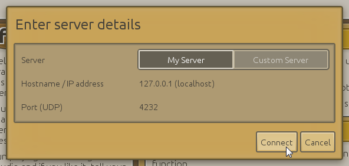
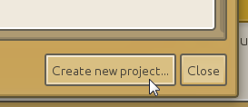

# Bien débuter avec CraftStudio

----

## Lanceur de CraftStudio

Une fois installé, le lanceur vous permet de vous connecter avec vos identifiants et prend soin de vérifier si des mises à jour sont disponibles avant de tout démarrer.

Notez que votre nom d'utilisateur et votre mot de passe sont *sensibles à la casse*. "timelapser" est différent de "Timelapser" et de "TimeLapser".

----

## Collaboration en temps-réel et accès aux projets

CraftStudio, c'est avant tout construire des choses ensemble. Même quand vous travaillez seul, vos projets sont gérés par un serveur indépendant de l'application principale, vous pouvez donc permettre à d'autres personnes de vous rejoindre et créer des choses géniales en collaboration.

Quand vous créez un nouveau projet, vous pouvez décider de qui peut y avoir accès en choisissant parmi 3 options d'accessibilité ainsi que le rôle par défaut des membres.

 * **Validation manuelle des nouveaux membres** : C'est le paramètre par défaut, quelqu'un peut envoyer une demande pour rejoindre votre projet que vous pouvez accepter ou refuser manuellement.
 * **N'importe qui peut rejoindre librement** : Celui-ci permet aux gens de rejoindre votre projet sans demander d'autorisation. Il est recommandé de ne l'utiliser qu'avec un rôle par défaut défini sur **Spectateur**.
 * **Sur invitation** : Pour que quelqu'un puisse rejoindre, vous allez devoir l'inviter depuis l'onglet Administration (pas encore implémenté)

Pour plus de détails sur la gestion des serveurs et projets, lisez la [Référence du Serveur](../Reference/Server.md).

----

## Créer un nouveau projet

Tout d'abord, vérifiez que votre serveur est lancé en cliquant sur le bouton *Mon Serveur* (et cliquer sur le bouton *Démarrer* si besoin). Une fois que tout est prêt, cliquez sur le bouton *Ajouter ou créer un projet...* situé en bas de votre liste de projets.

Cela ouvrira un pop-up qui vous laisse décider à quel serveur vous voulez vous connecter. Cliquez simplement sur *Connexion* puisque nous voulons nous connecter sur notre serveur et non celui de quelqu'un d'autre.

Sur le nouveau pop-up qui apparaîtra, cliquez sur le bouton *Créer un projet...*.

Entrez un nom et une description (facultative) pour votre projet. Si vous le souhaitez, vous pouvez changer les paramètres d'accessibilité et le rôle par défaut des membres (comme décrit précédemment).

Ne vous inquiétez pas, vous pourrez changer ces paramètres à tout moment en passant par l'onglet "Administration" du projet.

Une fois que votre projet est créé, ajoutez-le à votre liste de projets en cliquant sur le bouton *Ajouter à ma liste*.

Tout est prêt ! Pour ouvrir votre nouveau projet, cliquez dessus depuis la liste des projets.

Et si nous commencions par [créer un space shooter](Space_shooter.md) ?